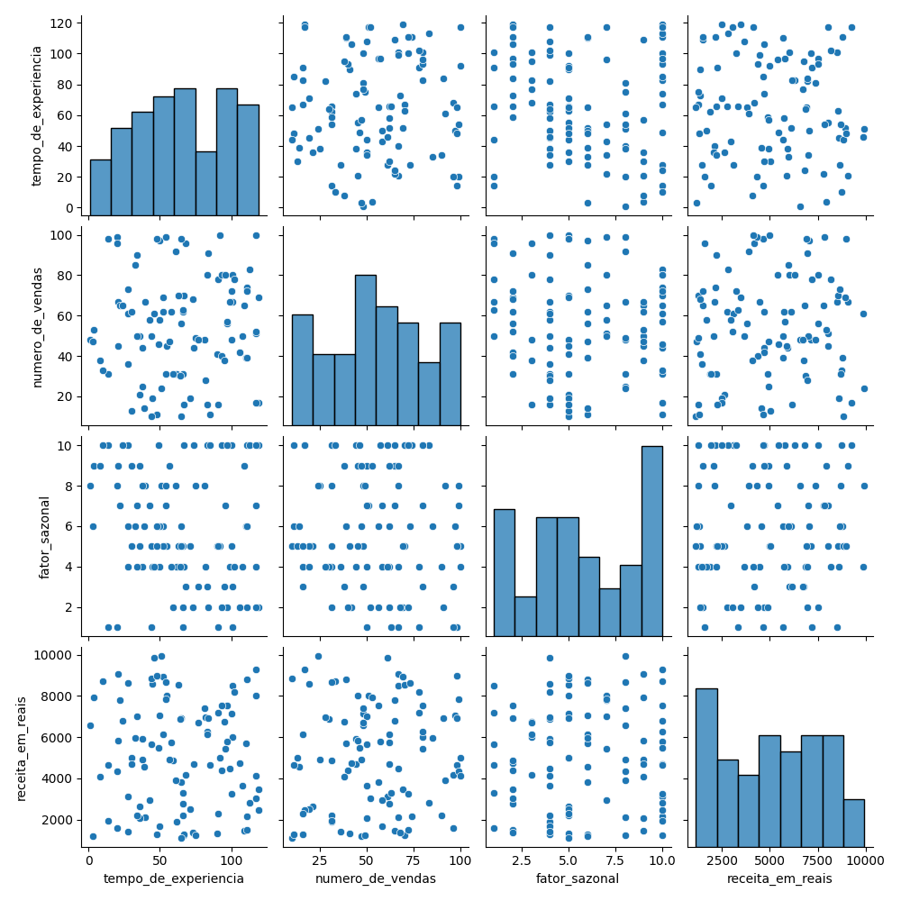
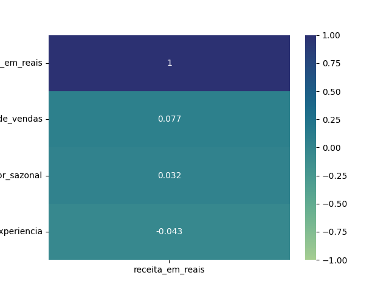
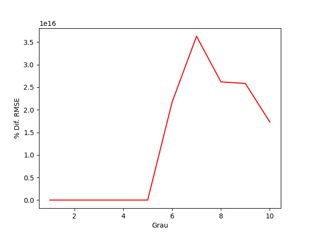
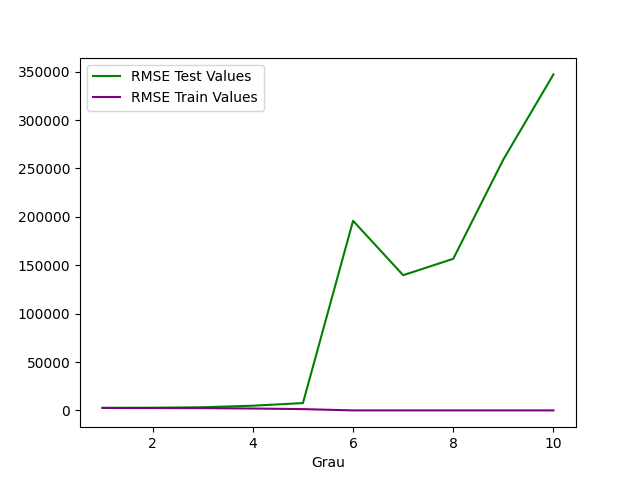
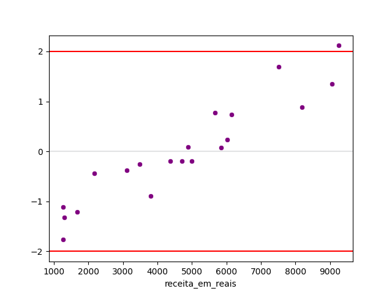
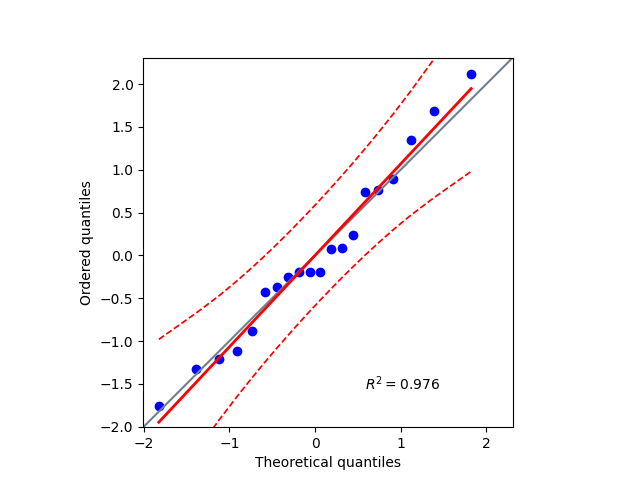

# Modelo: Previsibilidade de Salário
Um modelo em **Regressão Polinomial** para prever quanto um vendedor de uma empresa fictícia de acordo com seus dados, sendo estes:
+ Número de vendas
+ Tempo na empresa (em meses)
+ Fator sazonal

## Sobre o projeto
1. Trata de uma análise exploratória de dados para verificar a relação dos dados com a variável target salario. Feita com pandas, seaborn e matplotlib.
2. Com o pairplot, é possível notar a relação entre as variáveis. Além disso, com o heatmap das correlações é possível ver quais variáveis independentes tem mais realação de pearson e spearman com o salário.
3. O treinamento do modelo é feito com vários graus polinomiais distintos até encontras um ótimo. Após encontrar um ótimo, realiza o treinamento a partir somente do ótimo. Também é feito o treinamento de um modelo linear para fins de comparação e mostrar como o modelo não é bom para esse cenário.
4. Após o treinamento do modelo, há uma análise da qualidade do modelo, usando métricas como erro médio absoluto, erro médio na raíz quadrada e r2_score.
5. Faz-se uma análise dos resíduos da solução, olhando seu testes de normalidade e de homocedasticidade para ver se estão próximos a uma distribuição normal.

## Tecnologias usadas
1. Python
2. Scikit-Learn
3. Seaborn
4. Matplotlib
5. Pandas
6. Scipy
7. Joblib
8.  Pingouin
### Como preparar o ambiente
```bash
pipenv sync
pipenv shell
```
### Como rodar o código que gera o modelo
```bash
python poly_model.py
```
## Aspectos do Modelo Treinado
### Análise do cenário



#### Variáveis numéricas
1. Pelo pairplot é possível enxergar que, em termos das variáveis numericas, nenhuma variável tem uma correlação clara com a target. Os pontos estão geralmente espalhados.
2. Pelos histogramas, é possível notar que as distribuições de *tempo de experiência* e *número de vendas* são aproximadamente uniformes. O fator sazonal mostra que o último fator sazonal é mais presente, o que gera uma assimetria negativa. Já a receita tem uma leve assimetria positiva, ou seja a maioria dos vendedores vendem menos.
3. Com os boxplots, vê-se que não há outliers em nenhuma coluna.

#### Variávies categóricas
Não há variáveis categóricas.

### Correção dos dados e salário
#### Correlação de Spearman


#### Correlação de Pearson


Pela correlação de Spearman e de Pearson é possível ver que a correlação entre as variáveis são muito baixas, o que já indica que o modelo linear não deve ser ideal para o problema. 

### Treinamento do modelo




Usou-se o método k-fold que divide o modelo em 5, usando embaralhamento dos dados. Com isso realiza testes repetidamente com 4 dados de treinamento 1 dado de teste. Com essa iteração tira os valores R²-Score, Rounded Mean Squared Error para os dados de treinamento e de teste, e obtém os resíduos. Isso é feito tanto para o modelo linear como para o modelo polinomial.<br />
Contudo, para o modelo polinomial, isso é feito para 10 graus polinomiais com o objetivo de compreender qual polinômio representa melhor o modelo. Ao final o **grau 3** aparentou ser o ótimo por apresentar uma diferença percentual de rmse entre predições de treino e de testes menores. Além disso, para esses graus, seu RMSE são muito parecidos para teste e treinamento, o que mostra que está conseguindo lidar com ambos os cenários sem mostrar underfitting e overfitting de forma mais expresiva.

### Comparação modelo linear múltiplo x modelo polinomial
|Modelo\Métricas| R²-Score | RMSE Teste | RMSE treinamento |
|:---:|:---:|:---:|:---:|
|Regressão Linear Múltipla|≃ -0.14|≃ R$ 2657.78|≃ R$ 2503.77|
|Regressão Polinomial|≃ -0.74|≃ R$ 3225.0|≃ R$ 2317.53|

1. ***R²-Score***: Mostra que o modelo linear explica melhor a variabilidade dos dados. Contudo, ambos os modelos são negativos, ou seja é melhor até usar a média dos dados para prever que os modelos. 
2. ***RSME***: Considerando que o mínimo e o máximo da receita são 1133 BRL e 9941 BRL, a raíz do desvio do erro médio é muito alto para ambos os casos tanto no cenário de teste, quanto de treinamento, logo ambos modelos são inadequados.

> ***Conclusão***: Nenhum dos modelos é bom para prever o dataset.

### Métricas do modelo polinomial
#### Métricas de linearidade e de outliers


1. Outliers: Pelos scatter dos resíduos, vê-se alguns 1 ponto acima de +2 e abaixo de -2.
2. Modelo polinomial inadequado e heterocedasticidade: Os resíduos estão espalhados formando um padrão de linha reta, o que indica que o modelo polinomial é inadequado e há heterocedasticidade.

#### Métricas de Normalidade dos Resíduos


- QQplot indica evidência de normalidade dos resíduos, já que os resíduos não escapam do limite traçado.

| P-valor de Shapiro-Wilk | P-valor de Kolmogorov-Smirnov | P-valor de Lilliefors |
|:--:|:--:|:--:|
|≃ 0.804|≃ 0.871|≃ 0.571|

> **H0**: *os resíduos seguem uma distribuição normal*<br/>
> **H1**: *os resíduos não seguem uma distribuição normal*
- Por ser acima de 0.05, *Lilliefors*, *Shapiro-Wilk* e *Kolmogorov-Smirnov* apontam evidência de distribuição normal dos resíduos, logo não há evidência suficiente para rejeitar a hipótese nula.
  
> *OBS: As estatísticas são mais sensíveis a outliers que o QQPlot. Por isso, o último, na maioria das vezes, é levado em questão com maior prioridade para afirmar que há distribuição normal dos resíduos que as estatísticas.*


### Conclusão
- Pela correlação de Spearman e pela correlação de Pearson já seria possível concluir que o modelo de regressão linear, nem o modelo polinomial são ideais para o cenário, pois a correlação das variáveis independentes com a receita não são fortes(Bem próximos de zero).
- Como o modelo linear tem um R²-Score maior que o modelo polinomial, então o modelo linear explica melhor a variabilidade dos resultados. Contudo, ambos modelos são inadequados para fazer previsões, pois apresentam R²-Score negativos.

### Créditos
Pedro Malini, 6 de Maio de 2026 